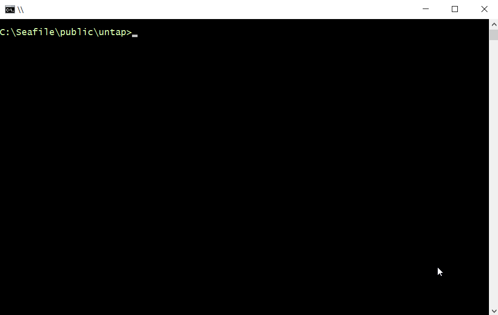

# untap

shrinks and paints TAP test output



• [Introduction](#introduction) • [Installation](#installation) • [Usage](#usage) • [Test](#test) • [License](#license) •


## Introduction

* Strips out the good news (ok...) and most of the extra line feeds
* Highlights the bad news in red (not ok...)
* Adds a one-line summary showing all passed, failed and skipped tests (eg. Summary: ..sx..x.)
* Includes a light cli interface to resolve files and directories
* No other dependencies, 5 files, all under 5kb for light local instals

There are multiple good reporters available but most have a relatively large set of dependencies and don't report skiped tests.	While `untap` works with any tap output, the initial design goal was to work with `tt` to provide a very light locally installed test suit for small projects.


## Installation

In node, from the project root folder type `npm i -D untap`.
You also need a testing library that produces TAP output (eg. tape, tt, tap)


## Usage

`untap` can be used inside javascript test files, inside an npm script or at the command line.

### npm script use
inside the package.json file:
```
"scripts": {
	"test": "untap mytestdirectory",
	"test_file": "untap mytestdirectory/mytestfile"
}
```
As a lightweight test runner `untap` locates the files and runs them all.


### direct use inside a test file
at the top of the test file:
```
require(untap).pipe()
```
All `console.log` calls that follow are intercepted and formatted.


### command line use
Directly from the command line:
```
> node mytestdirectory/mytestfile | untap
```
```
> tape mytestdirectory | untap
```

## Test

In node, from the project root type `npm test`. The tests include errors to see the output format.


## License

Released under the [MIT License](http://www.opensource.org/licenses/MIT)
